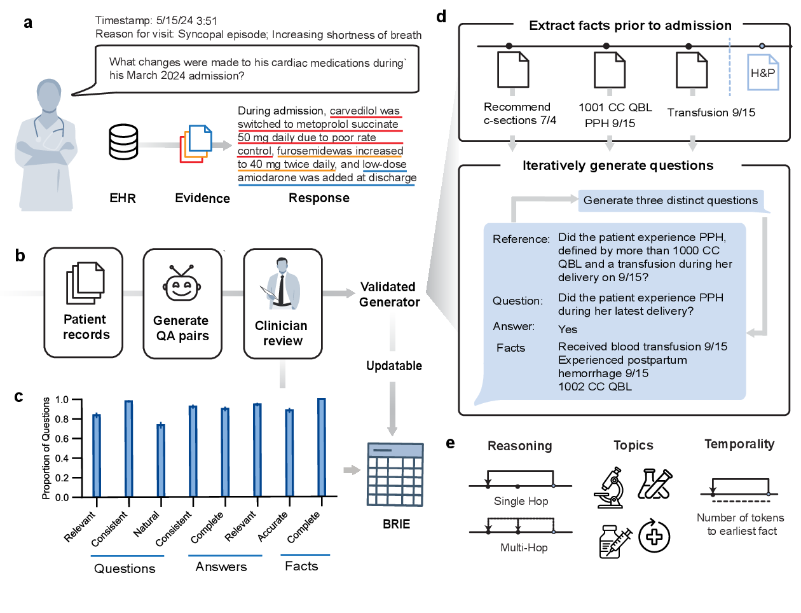

# BRIE

BRIE (Benchmark to Retrieve Information in EHRs) is a living clinical
information-retrieval benchmark for evaluating how well models and agents find
patient information in longitudinal clinical notes. Its scalable generation
framework automatically creates question-answer pairs from EHRs. Nineteen
clinicians completed 144,036 individual annotations to validate the accuracy
and clinical relevance of the benchmark items.

BRIE organizes its evaluations along three categories (reasoning, temporality, and
clinical topic) to expose distinct failure modes in state-of-the-art retrieval
systems. Because the generation framework itself is validated, BRIE can be
refreshed with new encounters to reduce benchmark leakage and measure
performance drift while limiting the need for repeated clinician filtering.

This repository contains the code for generating BRIE-style benchmarks,
producing model responses with full-context and retrieval-based methods, and
evaluating those responses. The benchmark data and full release details will
be provided separately.

[](docs/brie_living.pdf)

*Overview of the BRIE benchmark and generation framework.*

## Documentation

- [Data contract and run guide](docs/DATA_FORMAT.md): input schemas, provider
  configuration, and detailed workflow commands.
- [Reproducibility guide](docs/REPRODUCIBILITY.md): required run metadata,
  evaluation definitions, and the recommended reproduction order.
- [Script inventory](docs/SCRIPT_INVENTORY.md): retained code paths and
  intentionally excluded repair or migration utilities.
- Final evaluation prompts:
  [fact entailment](src/brie/evaluation/prompts/fact_entailment.yaml) and
  [pairwise Elo](src/brie/evaluation/prompts/elo_pairwise.yaml). The evaluators
  load these files directly.

## Contents

- `brie.generation`: fact extraction, question generation and filtering,
  topic assignment, reference-answer generation and revision, and evidence
  span extraction.
- `brie.inference`: full-context, rolling-context, agentic, BM25, dense, and
  late-interaction response generation.
- `brie.evaluation`: traditional metrics, atomic-fact entailment,
  hallucination and rubric evaluation, temporal-leakage checks, pairwise win
  rates and Elo, and human/ICL calibration utilities.
- `scripts/`: generic entry points for the three top-level workflows and the
  repository audit.


## Usage

<details>
<summary><strong>1. Install and configure BRIE</strong></summary>

BRIE requires Python 3.10 or newer and uses `uv` for a locked environment.
Python 3.12 is the reference runtime.

```bash
git clone https://github.com/alsentzerlab/brie
cd brie
uv sync --locked --all-extras
uv run python -m brie.validate --help
```

Use `--all-extras` to reproduce every workflow. Smaller installations can use
`--extra retrieval` for dense/late-interaction retrieval, `--extra metrics`
for optional text metrics, or `--extra dev` for tests and linting.

Provider credentials and infrastructure settings are supplied at runtime.
Common variables include:

```bash
export BRIE_VERTEX_PROJECT='<project>'
export BRIE_VERTEX_LOCATION='<region>'
export BRIE_VERTEX_GCS_BUCKET='<bucket>'

# Or an OpenAI-compatible endpoint:
export BRIE_OPENAI_BASE_URL='<endpoint>'
export BRIE_OPENAI_API_KEY='<secret>'
export BRIE_OPENAI_MODEL='<model>'
```

The complete provider-variable list is in the
[data contract](docs/DATA_FORMAT.md#provider-configuration). Do not place
secrets in this checkout.

</details>

<details>
<summary><strong>2. Prepare and validate external data</strong></summary>

Keep input data and generated artifacts outside the repository:

```text
$BRIE_DATA/
  questions.csv
  notes/
    <subject_id>_subsetrecords.json

$BRIE_RUN/
  responses.csv
  scores.csv
  atomic_facts.csv
  fact_scores.csv
  pairwise.csv
  elo.csv
```

Set those locations and validate the inputs before running a model:

```bash
export BRIE_DATA='/approved/location/brie-data'
export BRIE_RUN='/approved/location/brie-run'
mkdir -p "$BRIE_RUN"

uv run python -m brie.validate \
  --questions "$BRIE_DATA/questions.csv" \
  --notes "$BRIE_DATA/notes" \
  --require-references
```

The code treats record identifiers as opaque strings and does not perform
de-identification. Use it only in an environment approved for the input data,
and keep inputs, responses, caches, logs, and evaluation outputs under the
applicable data controls. Exact schemas are documented in the
[data contract](docs/DATA_FORMAT.md).

</details>

<details>
<summary><strong>3. Generate a benchmark</strong></summary>

Skip this section when using an existing BRIE release. Dataset construction
expects the canonical note files plus one admission-summary file per subject,
as described under
[dataset-construction inputs](docs/DATA_FORMAT.md#dataset-construction-inputs-and-outputs).

Run fact extraction, question generation, and question filtering:

```bash
uv run bash scripts/run_generation.sh \
  '<comma-separated-subject-ids>' \
  "$BRIE_DATA/notes" \
  "$BRIE_RUN/generation"
```

The main output is
`$BRIE_RUN/generation/selected/questions_filtered.csv`. Optional later stages
can add topics, generate or revise reference answers, and extract evidence
spans:

```bash
uv run python -m brie.generation.get_topics --help
uv run python -m brie.generation.generate_multiple_answers --help
uv run python -m brie.generation.revise_answer --help
uv run python -m brie.generation.get_factspans --help
```

Each module exposes its complete input contract with `--help`; the generated
files and required columns are listed in the
[dataset-construction data contract](docs/DATA_FORMAT.md#dataset-construction-inputs-and-outputs).

</details>

<details>
<summary><strong>4. Generate model responses</strong></summary>

The generic launcher runs full-context inference:

```bash
uv run bash scripts/run_inference.sh \
  "$BRIE_DATA/questions.csv" \
  "$BRIE_DATA/notes" \
  "$BRIE_RUN/responses.csv" \
  gemini_flash
```

The same input contract supports the other paper inference approaches:

```bash
# Rolling context
uv run python -m brie.inference.get_predictions_rolling \
  --questions "$BRIE_DATA/questions.csv" \
  --notes "$BRIE_DATA/notes" \
  --output "$BRIE_RUN/responses_rolling.csv" \
  --models gemini_flash

# BM25 retrieval
uv run python -m brie.inference.get_predictions_rag_bm25 \
  --questions "$BRIE_DATA/questions.csv" \
  --notes "$BRIE_DATA/notes" \
  --output "$BRIE_RUN/responses_bm25.csv" \
  --models gemini_flash
```

Agentic, dense-retrieval, and late-interaction commands are
`brie.inference.get_predictions_agent`,
`brie.inference.get_predictions_rag_embedding`, and
`brie.inference.get_predictions_rag_late`. Dense and late-interaction runs
require their corresponding precomputation command and an external embedding
directory. All inference paths enforce the question timestamp cutoff before
constructing model context.

</details>

<details>
<summary><strong>5. Evaluate responses</strong></summary>

Run general answer metrics:

```bash
uv run bash scripts/run_evaluation.sh \
  "$BRIE_DATA/questions.csv" \
  "$BRIE_RUN/responses.csv" \
  "$BRIE_RUN/scores.csv"
```

For atomic-fact recall, precision, and hallucination evaluation, create an
external atomization configuration and run:

```bash
uv run python -m brie.evaluation.atomize_facts_batch \
  --config "$BRIE_RUN/atomize.yaml" \
  --output "$BRIE_RUN/atomic_facts.csv"

uv run python -m brie.evaluation.score_facts_batch \
  --facts "$BRIE_RUN/atomic_facts.csv" \
  --gcs-location '<cloud-output-prefix>' \
  --output "$BRIE_RUN/fact_scores.csv"

uv run python -m brie.evaluation.hallucination.score \
  "$BRIE_RUN/fact_scores.csv" \
  "$BRIE_RUN/hallucination.csv"
```

To identify exactly which candidate facts are unsupported and locate supported
facts in the longitudinal timeline, run the record-level provenance search:

```bash
uv run python -m brie.evaluation.find_facts \
  --facts "$BRIE_RUN/atomic_facts.csv" \
  --questions "$BRIE_DATA/questions.csv" \
  --notes "$BRIE_DATA/notes" \
  --output "$BRIE_RUN/fact_provenance.jsonl" \
  --facts-column facts_atomic \
  --retrieval bm25 \
  --model gemini_flash
```

Each output row includes `is_hallucinated`, `timeline_position`, the earliest
and latest supporting-note dates, exact evidence, and retrieval metadata. A
model/API failure is labeled `inconclusive`, never hallucinated. Use
`--retrieval hybrid --embeddings-dir <external-directory>` for BM25 plus dense
retrieval.

Audit retrieval for future-note leakage:

```bash
uv run python -m brie.evaluation.temporality.score \
  "$BRIE_RUN/responses_bm25.csv" \
  "$BRIE_RUN/temporality.csv" \
  --questions "$BRIE_DATA/questions.csv"
```

Compute two-position pairwise judgments, win rates, and Elo for a response file
containing at least two models per question:

```bash
uv run python -m brie.evaluation.score_elo_batch \
  --questions "$BRIE_DATA/questions.csv" \
  --responses "$BRIE_RUN/responses.csv" \
  --output "$BRIE_RUN/pairwise.csv" \
  --elo "$BRIE_RUN/elo.csv" \
  --judge jury \
  --gcs-location '<cloud-output-prefix>'
```

Detailed configuration, output schemas, rubric scoring, and human-calibration
commands are in the [data contract](docs/DATA_FORMAT.md). Metric definitions
and the exact-reproduction checklist are in the
[reproducibility guide](docs/REPRODUCIBILITY.md).

</details>

<details>
<summary><strong>6. Verify the repository</strong></summary>

Before using or publishing a change, run:

```bash
uv run bash scripts/check_repository.sh
```

This validates the lockfile, parses and lints Python and Bash files, runs the
tests, loads every retained CLI, rejects data/output artifacts, and scans for
embedded credentials, internal paths, endpoints, and long identifiers.

</details>

## Citation

```
@misc{cahoon2026livingbenchmarkinformationretrieval,
      title={A Living Benchmark for Information Retrieval from Electronic Health Records}, 
      author={Jordan L. Cahoon and Chloe O. Stanwyck and Sulaiman Somani and Philip Chung and Kevin R Keet and Kameron C. Black and Andrea T. Fisher and Sarita Khemani and Jerry Liu and Stephen Ma and Saloni K. Maharaj and Rita M. Pandya and Eduardo Perez-Guerrero and Priyanka Pillai and Lisa Shieh and David J. H. Wu and James Xie and James C. McAvoy and Teresa Nguyen and Jessica Tran and Lucy Yin and Bridget Lin and Alison Callahan and Jason A. Fries and Nigam H. Shah and Emily Alsentzer},
      year={2026},
      eprint={2609.30205},
      archivePrefix={arXiv},
      primaryClass={cs.AI},
      url={https://arxiv.org/abs/2609.30205}, 
}
```
